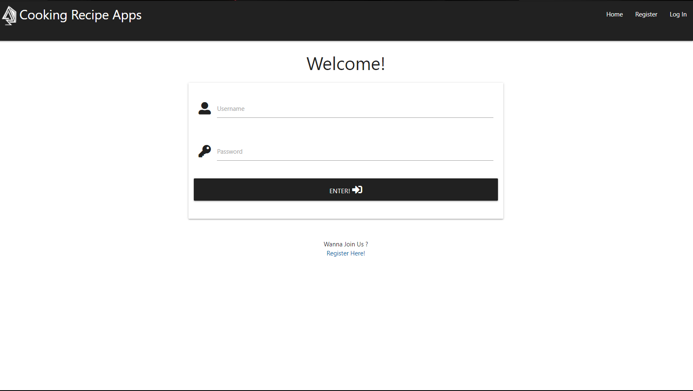
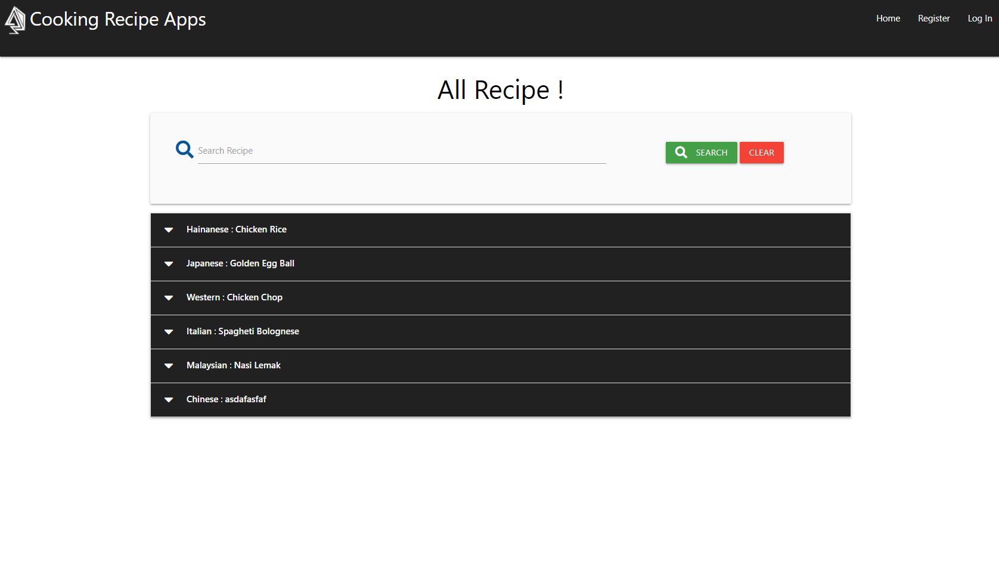
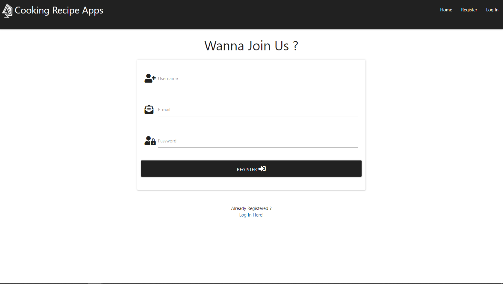
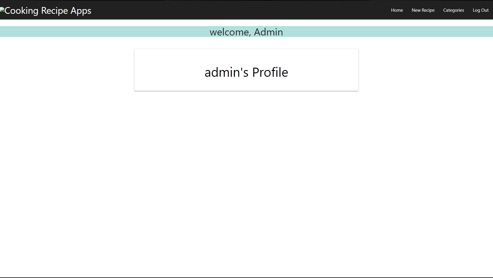
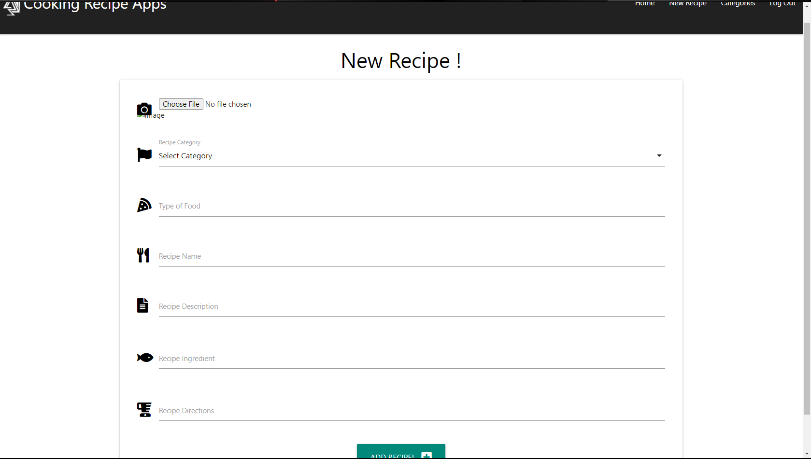
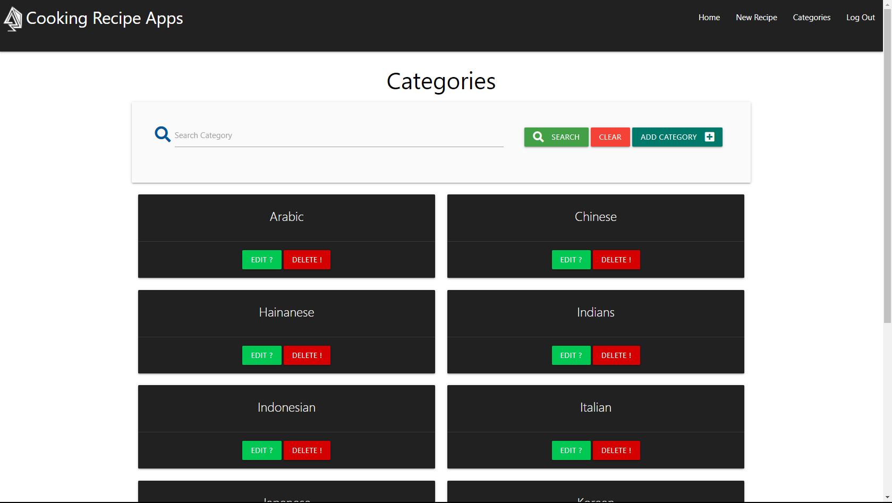
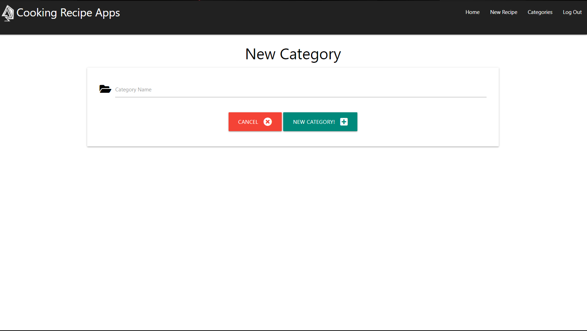
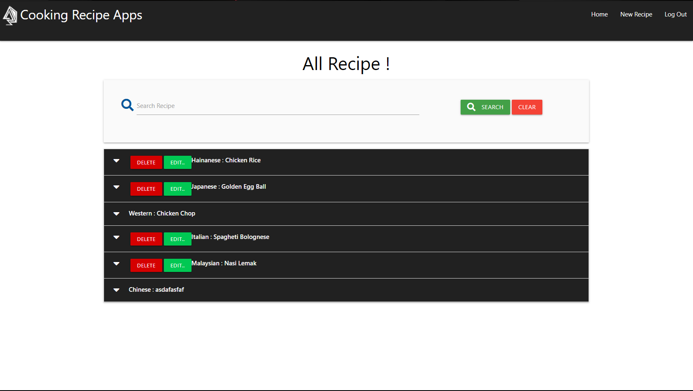
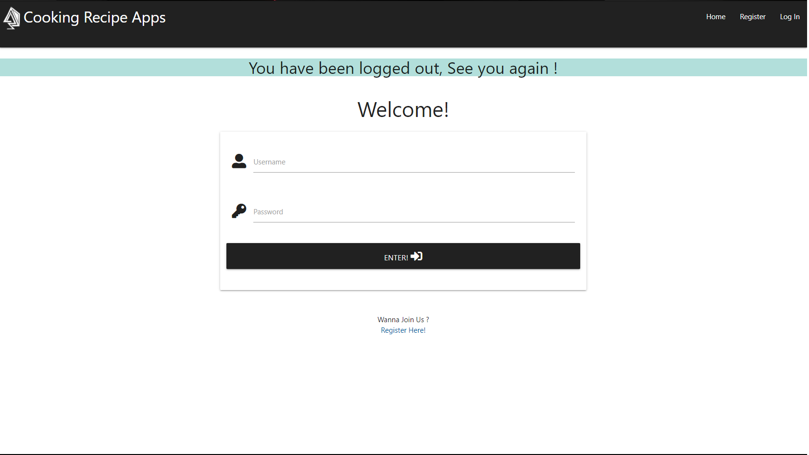

### Project Discription.

**Cooking Recipe App**

Cooking Recipe App is a app for user to take note and keep the recipe to the apps.

## Table of contents
* [Ux](#Ux)
* [Feature](#Feature)
* [Technologies-Used](#Technologies-Used)
* [Deployment](#Deployment)
* [Credits](#Credits)
* [Acknowledgements](#Acknowledgements)

## Ux
This Cooking Recipe App project is suit for everyone.

  * Project Goals
    Cooking Recipe App is a app for user to take note and store the recipe to the apps that can connect all the user around the world
    to learn and produce new recipe, and this app can produce new chef in the future easier.

## Feature

    - On arriving at the page for the first timer, user can see the login page and can register as a new user, can see all the existing user recipe.

    - On home page, new and existing user can access all the recipe without login.

    - On the register page, all the new comers can register to be apart of the cooking recipe app.

    - After the user login, the welcome page will show up to welcome all the user to the app.

    - On this page, user can see all the recipe in this app collection. But user only can edit their own recipe, and add new recipe.

    - This is the page of the new recipe form for the user add new recipe.

    - This page is the only page that can be access by admin to add or remove recipe categories.

    - This page contain new categories form to fill by admin.

    - This is the view for the normal user (not admin) without categories section.

    - After all the user including admin logout, there will be a popout that shows "you have loged out, and see you again".

## Technologies Used

* GitHub
  - This project uses GitHub to store and share all project code remotely.
  - The new GitHub Projects planner was utilised to plan and keep track of this project. This project plan can be viewed here.
  
* GitPod
  - Developer used GitPod for their IDE while building the website.

* Hiroku
  - Developer used Hiroku for their Deployment after building the website.
  
* Photoshop
  - his project used tools in Photohshop to edit, crop and save images as well as ulitising the colour picker to ensure color     consistency over the entire project.
  
* materialize
  - The project uses materialize to simplify the structure of the website and make the website responsive easily.
  - The project also uses materialize to provide icons from FontAwesome

* W3c Validator
  - Using this website to check all the error in html.

## Deployment
This project was developed using the GitPod, and pushed to GitHub using the built in function within GitPod.
To deploy the Mad's Lab, to GitHub Pages from its GitHub repository, the following steps have to be done:
  - Log into GitHub.
  - Navigate the GitHub repository.
  - Click on the setting tab at the top of the repository bar.
  - Scroll down on that page to the GitHub Pages section.
  - The first drop-down field should be Source with None preselected.
  - Select master branch from the list.
  - The page should refresh.
  - Scroll back down to the GitHub Pages section.
  - You should now have a deployed link.
  
The Mad's Lab project made use of several branches for development, testing and bug fixing. The Master Branch has always been the one deployed to GitHUb Pages. When displaying the website life, the developer tries to keep the master branch to optimal code only. At the moment of submitting this Milestone project the Development Branch and Master Branch are identical.

## Credits

**Content**
* All the content in this project is written by muhammad syafiq.

**Media**
* Image
  - Most of the image basiccaly on this website page.
  
**Code**
* Reference code for the html and css are referred from W3School and materialize. 

## Acknowledgements
Special thanks to:
* Code Institute Mentor, Miss Antonija Simic for his time and support in explaining and demonstrating areas of code this developer was struggling to understand.
* Code Institute Tutor, for their time and support in explaining and demonstrating areas of code this developer was struggling to understand. 
 
A fully responsive website using HTML5 ,javascript and python

